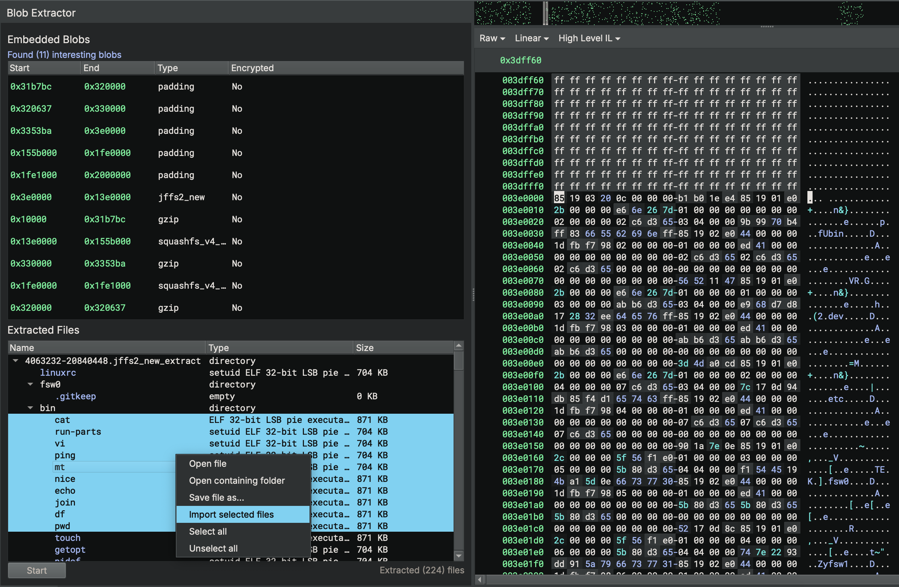

# Blob Extractor
Author: **Vector 35 Inc.**

_Binary Ninja plugin for extracting files from container formats_



## Description

Blob Extractor is a Binary Ninja plugin that leverages the [Unblob API](https://github.com/onekey-sec/unblob) to
identify and extract compressed archives, file-systems, and other blobs embedded in container binaries such as flash
dumps or firmware images.

## Installation Instructions

The following dependencies are required by this plugin:

* [unblob](https://github.com/onekey-sec/unblob) - Python package for extracting files from container formats
* libmagic - Native libmagic file type identification library
* [python-magic](https://github.com/ahupp/python-magic) - Python bindings for libmagic

If the plugin is installed from the Binary Ninja plugin manager, the Python dependencies should install
automatically. However, the `libmagic` native library must be installed manually. The instructions below provide
guidance on how to install the plugin and its dependencies manually. Step 1 is required for all installation methods.

### Darwin

1. Install the `libmagic` native library

```
brew install libmagic
```

2. Clone the repository into the Binary Ninja `plugins` directory (or install from the Binary Ninja plugin manager)

```
git clone git@github.com:Vector35/blob_extractor.git "/Users/$USER/Library/Application Support/Binary Ninja/plugins/blob_extractor"
```

3. Install the dependency Python packages for the Python version in use by Binary Ninja. These packages should be
installed from the `requirements.txt` file, included in the plugin repository.

```
cd "/Users/$USER/Library/Application Support/Binary Ninja/plugins/blob_extractor"
pip3 install -r requirements.txt
```

### Linux

1. Install the `libmagic` native library

```
sudo apt-get install libmagic1
```

2. Clone the repository into the Binary Ninja `plugins` directory (or install from the Binary Ninja plugin manager)

```
git clone git@github.com:Vector35/blob_extractor.git ~/.binaryninja/plugins/blob_extractor
```

3. Install the dependency Python packages for the Python version in use by Binary Ninja. These packages should be
installed from the `requirements.txt` file, included in the plugin repository.

```
cd ~/.binaryninja/plugins/blob_extractor
pip3 install -r requirements.txt
```

### Windows

Windows is not supported by this plugin. Blob Extractor depends on `libmagic`, Unblob, and Unblob's extractor utilities.
These dependencies do not run on Windows.

## Extractor Utilities

Unblob uses external utilities for file extraction. After installing Unblob (via the installation instructions above)
run the following command to identify missing external extractor utilties:

```
> unblob --show-external-dependencies
The following executables found installed, which are needed by unblob:
    7z                          ✓
    debugfs                     ✗
    jefferson                   ✓
    lz4                         ✓
    lziprecover                 ✓
    lzop                        ✓
    sasquatch                   ✗
    sasquatch-v4be              ✗
    simg2img                    ✓
    ubireader_extract_files     ✓
```

_Note: unblob is installed at `~/.local/bin/unblob` on Linux._

Missing extractor utilities must be installed manually. Linux users can install the majority of the external
dependencies using `apt`. MacOS users can use `brew`. Some of the external dependencies, such as `sasquatch`, must be
built from source. Blob Extractor will still run without external extractor utilities. However, it will be unable to
extract certain blob formats. See the [Install Extractors](https://unblob.org/installation/#install-extractors) section
from the Unblob documentation for more information.

## Troubleshooting

**The plugin icon is not appearing in the Binary Ninja sidebar**

This is most likely because the plugin dependencies have not been installed properly and the plugin failed to load. It
is recommended to open the Binary Ninja log and see if there is a Python traceback originating from Blob Extractor. The
traceback should indicate what the issue is. If you are unable to run `unblob` from the command-line, it likely won't
run from the plugin either. Be sure to follow the installation steps above and verify that `unblob` and its dependencies
are installed correctly by running `unblob --show-external-dependencies` from your terminal.

**The plugin is not extracting any files, or extracted files are empty**

This is most likely because the required external dependencies for Unblob have not been installed. For example, if
you're extracting a flash dump that contains a squash file system, you must have sasquatch installed on your system. For
JFFS2 you need jefferson, and so on. See the `Extractor Utilities` section above. Also reference the
[Install Extractors](https://unblob.org/installation/#install-extractors) section from the Unblob documentation.

## License

This plugin is released under an [MIT license](./LICENSE).
